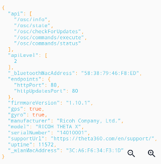
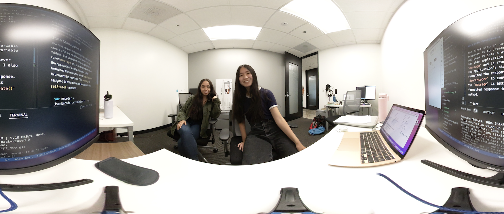

# THETA X Buttons using State Management


This application connects to a RICOH THETA X camera with the http package from Dart and outputs the response to the screen using state management. It uses a Stateful widget and updates the outputted response inside of the `setState()` method.  

## State Management

The first step to outputting the response is to create a String variable and pass it into a Widget. The variable for this application is called `message` and is reassigned whenever the application's state changes. I also formatted the response using `JsonEncoder` to convert the response. The `message` is assigned to this formatted response in the `setState()` method. 

```dart
var encoder = JsonEncoder.withIndent('  ');
var formattedResponse = encoder.convert(jsonDecode(response.body));
setState(() {
    message = formattedResponse;
});
```

## Syntax View

The application uses the [Flutter Syntax View](https://pub.dev/packages/flutter_syntax_view) package to display a certain theme. I used the `ayuLight` theme from the package.

```dart
child: SyntaxView(
code: message,
syntax: Syntax.DART,
syntaxTheme: SyntaxTheme.ayuLight(),
withLinesCount: false,
                )
```



## Taking Pictures 

This is a sample picture taken with the app. 

